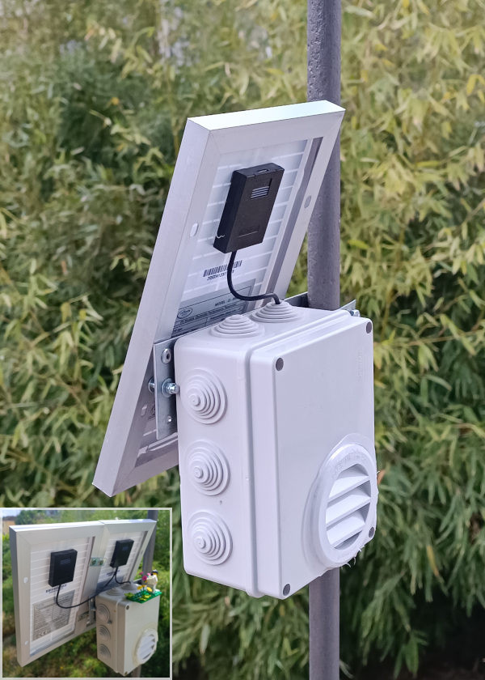
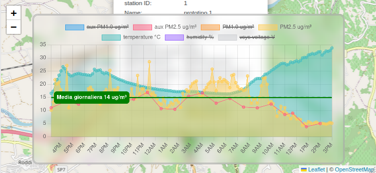

# outdoor particulate matter  station

current development status: [Proof of Concept.](roadmap.md)

IoT system monitoring outdoor air quality with multiple stations, remote data collection and analytics

## Supported sensors 

|sensor| description | physical dimensions| max connected sensors |
|--|--|--|--|
| pms5003 | PM Sensor PMS5003 | pm1.0 pm2.5 | 2 |
| pms5003T | PM Sensor PMS5003T | pm1.0 pm2.5 humidity temperature | 2 |
| sngcja5 | PM Sensor SN-GCJA5 | pm1.0 pm2.5 | 1 |
| sps30 | PM Sensor SPS30 | pm1.0 pm2.5 | 1 |
| bmp280 | Pressure sensor BMP280 | barometric pressure | 1 |
| aht20 | Humidity and Temperature Sensor AHT20 | humidity temperature | 1 |

* there is an overall max number of 2 connected PM sensors at the same time, regardless of the model. The limit is software, therefore it can be overcome.
